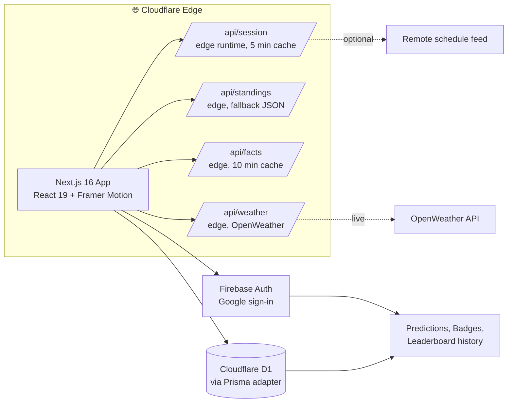

<!-- =====================================================================
     TRGT — Target Every Lap
     An elite Formula 1 fan platform.
     ===================================================================== -->

<div align="center">


# 🏁 TRGT &nbsp;·&nbsp; **Target Every Lap**

### A cinematic Formula 1 fan platform — live standings, race predictions, circuit telemetry, weather, and lap-by-lap intelligence.

<a href="https://trgt.in"></a>
<a href="https://trgt.in/standings"></a>
<a href="https://trgt.in/predict"></a>
<a href="https://trgt.in/leaderboard"></a>

<br />

<a href="https://github.com/Abhinavv-007/f1/stargazers"></a>
<a href="https://github.com/Abhinavv-007/f1/commits/main"></a>
<a href="https://github.com/Abhinavv-007/f1/pulse"></a>


<br />

<sub><b>Lights out. Five red lights. <i>Go.</i></b></sub>

</div>

<br />

---

## ✦ What is TRGT?

> **TRGT** (read: <i>"target"</i>) is an elite Formula 1 fan platform built around three obsessions: <b>live race intelligence, predictive scoring, and a cinematic UI</b>. It surfaces the season schedule, an animated countdown to lights-out, a permanent driver and constructor leaderboard, circuit-by-circuit telemetry, weather, and a per-race prediction game with badges, points, and a global ranking.

<table>
  <tr>
    <td width="50%" valign="top">
      <h3>📡 Live Race Session</h3>
      <p>An always-on countdown to the next session. Free Practice 1/2/3, Qualifying, Sprint, and Race timestamps for every Grand Prix on the 2026 calendar — auto-rolling forward as sessions complete.</p>
    </td>
    <td width="50%" valign="top">
      <h3>🎯 Predict The Race</h3>
      <p>Lock in your podium, fastest lap, pole, and sprint picks before each round goes locked. Earn points based on accuracy. Climb the global leaderboard.</p>
    </td>
  </tr>
  <tr>
    <td width="50%" valign="top">
      <h3>🏆 Standings & Leaderboards</h3>
      <p>Drivers' championship, constructors' championship, and a live <i>fan</i> leaderboard tracking prediction accuracy across the season. Every screen is a glassmorphic, motion-driven board.</p>
    </td>
    <td width="50%" valign="top">
      <h3>🛣 Circuit Intelligence</h3>
      <p>Per-circuit deep dives: weather (live OpenWeather), AI-generated circuit insight, lap distance, total race distance, and historical context. Built on edge runtime for low latency.</p>
    </td>
  </tr>
  <tr>
    <td width="50%" valign="top">
      <h3>👤 Profile & Badges</h3>
      <p>Sign in with Google (Firebase Auth). Earn collectible badges as you predict, share screenshots of your race tickets to socials, and track your historical accuracy.</p>
    </td>
    <td width="50%" valign="top">
      <h3>⚡ Edge-First, Cinematic</h3>
      <p>Next.js 16 + React 19 + Framer Motion + Tailwind 4 deployed to Cloudflare Pages with a Cloudflare D1 database adapter. Every API route runs at the edge.</p>
    </td>
  </tr>
</table>

---

## ✦ Architecture



---

## ✦ Surfaces

| Route | Purpose |
| --- | --- |
| `/` | Hero, session countdown, headline standings, circuit teaser |
| `/standings` | Drivers + constructors championship boards |
| `/predict` | Lock in podium / pole / fastest-lap picks before lockout |
| `/leaderboard` | Global fan leaderboard ranked by prediction points |
| `/live` | Live race overlay with weather, countdown, circuit context |
| `/stats` | Season stats hub |
| `/stats/[circuitId]` | Per-circuit deep dive |
| `/profile` | Badges, history, your accuracy |
| `/login` | Google sign-in via Firebase |
| `/privacy` · `/terms` | Legal |

---

## ✦ API

All routes run on the **edge runtime** for sub-100ms response times.

| Method | Endpoint | Description | Cache |
| --- | --- | --- | --- |
| `GET` | `/api/session` | Current/next session snapshot from the 2026 calendar | 5 min |
| `GET` | `/api/standings` | Drivers + constructors championship | n/a |
| `GET` | `/api/facts?circuit=<id>&lap=<n>` | AI-generated circuit insight | 10 min |
| `GET` | `/api/weather?circuit=<id>` | Live weather at the circuit | 10 min |

Example:

```bash
curl https://trgt.in/api/session
curl "https://trgt.in/api/weather?circuit=monaco"
curl "https://trgt.in/api/facts?circuit=silverstone&lap=42"
```

---

## ✦ Tech Stack

<p>
  
  
  
  
  
  <br />
  
  
  
  
  <br />
  
  
  
  
</p>

---

## ✦ Local Dev

```bash
git clone https://github.com/Abhinavv-007/f1.git
cd f1
npm install

# Generate the Prisma client first
npx prisma generate

# Run the dev server
npm run dev
# → http://localhost:3000
```

> Add a `.env.local` for the optional secrets:
> - `OPENWEATHER_KEY` — for `/api/weather`
> - `GEMINI_API_KEY` — if you wire `@google/generative-ai` into custom facts
> - `NEXT_PUBLIC_FIREBASE_*` — for Firebase auth

---

## ✦ Build & Deploy

```bash
# Standard Next build (webpack)
npm run build

# Cloudflare Pages build
npm run pages:build
npx wrangler pages deploy .vercel/output/static --project-name=f1
```

`wrangler.toml` is pre-configured to mount the static output as a Cloudflare Worker site.

---

## ✦ Project Layout

```text
f1/
├── prisma/
│   ├── schema.prisma         # User, Prediction, Badge, LeaderboardSnapshot
│   └── migration.sql
├── migrations/0001_init.sql  # D1 migration
├── src/
│   ├── app/
│   │   ├── (page.tsx, layout.tsx, globals.css)
│   │   ├── api/{session,standings,facts,weather}/route.ts  # edge routes
│   │   ├── standings/  predict/  leaderboard/  live/  stats/[circuitId]/
│   │   ├── profile/    login/    privacy/      terms/    actions/
│   ├── components/{auth, layout, legal, ui}
│   ├── data/           # calendar.json, circuits.json, drivers.json, teams.json, standings.json
│   ├── hooks/          # useRaceSession, etc.
│   └── lib/            # race.ts, badges.ts, prisma.ts, firebase.ts, http.ts
├── public/             # bg.mp4, og-image.png, brand assets
├── wrangler.toml
└── next.config.ts
```

---

## ✦ Roadmap (highlights)

- [x] 2026 calendar + session countdown
- [x] Drivers + constructors standings boards
- [x] Per-circuit weather + AI insight (Gemini)
- [x] Predict the race + global leaderboard
- [x] Firebase Google sign-in
- [x] Cloudflare D1 via Prisma adapter
- [ ] Live timing overlay (delta-to-leader)
- [ ] Sprint-only lockout flow
- [ ] Pro tier with private leagues

---

## ✦ Star History

<a href="https://star-history.com/#Abhinavv-007/f1&Date">
  
</a>

---

<div align="center">
  <sub>🏎 Built and engineered by <a href="https://abhnv.in"><b>Abhinav Raj</b></a> · ship every Sunday — race day.</sub>
  <br/>
  <a href="https://abhnv.in">Portfolio</a> · <a href="https://www.linkedin.com/in/abhnv07/">LinkedIn</a> · <a href="https://x.com/Abhnv8">X</a> · <a href="https://www.instagram.com/abhinavv.007/">Instagram</a>
  <br/><br/>
  <sub>📅 <i>Last impression </i> · <i>Total commits </i></sub>
</div>
